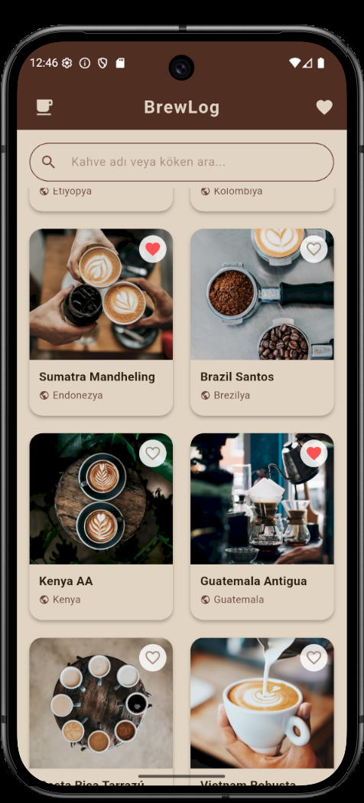
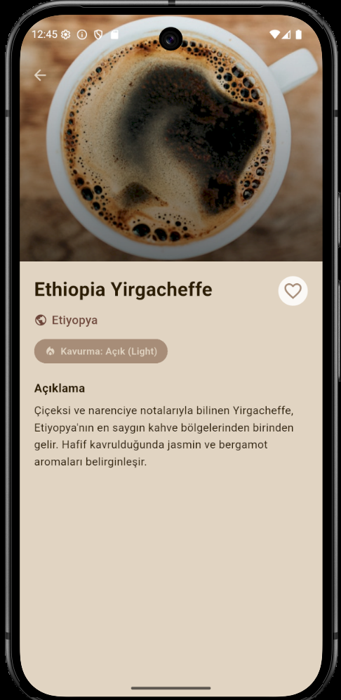
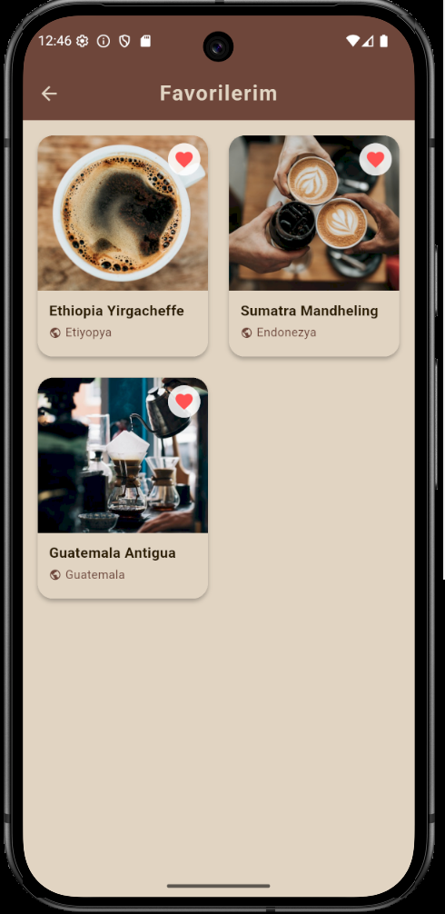

# ☕ BrewLog

BrewLog, Flutter ve Dart kullanılarak geliştirilmiş, minimalist tasarıma sahip asenkron bir mobil kahve katalog uygulamasıdır. Kullanıcıların dünya kahvelerini incelemesini, arama yapmasını ve favorilerini yönetmesini sağlar.

## 🚀 Özellikler
- **Asenkron Veri Yönetimi:** Kahve verileri `FutureBuilder` mimarisiyle yerel bir JSON dosyasından asenkron olarak çekilir ve önbelleğe alınır.
- **Anlık Arama & Filtreleme:** Arayüz performansını etkilemeyen, kahve adı ve kökenine göre çalışan çift yönlü yerel filtreleme algoritması.
- **Kart Tabanlı Tasarım:** Bellek yönetimini optimize eden `GridView.builder` (lazy-loading) yapısı.
- **State Yönetimi & Yaşam Döngüsü:** Favori ekleme/çıkarma işlemleri ve controller kaynaklı bellek sızıntılarını (memory leak) önleyen `StatefulWidget` entegrasyonu.
- **Hata Yönetimi (Error Handling):** Ağ gecikmeleri veya hatalı URL'lere karşı `errorBuilder` koruması.

## 📱 Ekran Görüntüleri
| Ana Sayfa | Ürün Detay | Favorilerim |
|---|---|---|
|  |  |  |

## 🛠️ Kullanılan Teknolojiler ve Sürüm Bilgisi
- **Framework:** Flutter (Sürüm: `3.22.x` veya bilgisayarınızdaki mevcut sürüm)
- **Dil:** Dart
- **Veri Formatı:** JSON (Asynchronous Asset Parsing)

## 🏃‍♂️ Çalıştırma Adımları

Bu projeyi yerel bilgisayarınızda sorunsuz bir şekilde ayağa kaldırmak ve çalıştırmak için aşağıdaki adımları sırasıyla takip edebilirsiniz:

### 1. Projeyi Klonlayın
Öncelikle GitHub üzerindeki kaynak kodları yerel makinenize indirmek için terminalinizi açın ve aşağıdaki komutu çalıştırın:
```bash
git clone https://github.com/gulseren44/BrewLog.git
````
2. Proje Dizinine Giriş Yapın
Klonlama işlemi tamamlandıktan sonra, terminal üzerinden projenin kök dizinine geçiş yapın:
```bash
cd BrewLog
````
3. Flutter Bağımlılıklarını Yükleyin
Projenin ihtiyaç duyduğu paketlerin ve bağımlılıkların (pubspec.yaml dosyasında tanımlanan) indirilmesi için pub komutunu çalıştırın:
```bash
flutter pub get
````
4. Bir Emülatör veya Cihaz Bağlayın
Uygulamayı çalıştırmadan önce bilgisayarınızda bir Android/iOS emülatörünün açık olduğundan veya fiziksel bir cihazın geliştirici modunda bilgisayara bağlı olduğundan emin olun. Bağlı cihazları listelemek için şu komutu kullanabilirsiniz:
```bash
flutter devices
````
5. Uygulamayı Başlatın
Her şey hazır olduğunda, uygulamayı derlemek ve bağlı olan cihazınızda test etmek için aşağıdaki komutu yürütün:
```bash
flutter run
````